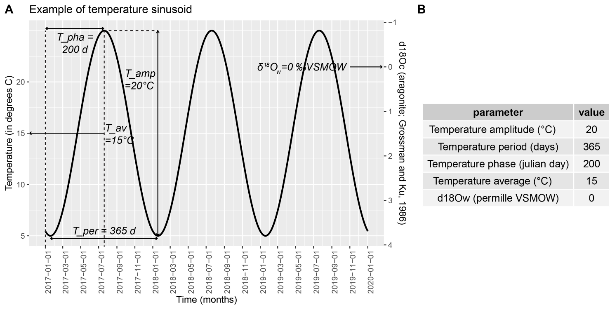
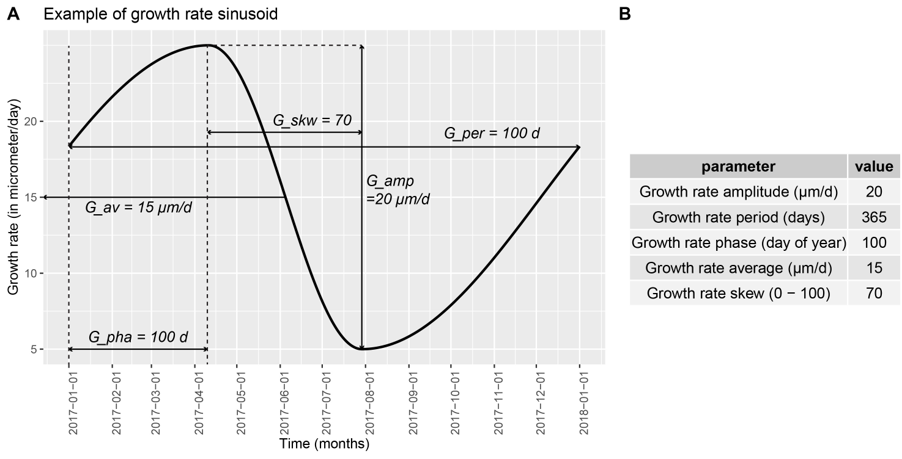

<!-- README.md is generated from README.Rmd. Please edit that file -->

# ShellChron

<!-- badges: start -->

[](https://travis-ci.com/nielsjdewinter/ShellChron)
<!-- badges: end -->

The ShellChron package contains all formulae and documentation required
to run the ShellChron model. The ShellChron model uses stable oxygen
isotope records (d18O) from seasonal paleo-archives to create an age
model for the archive.

In short, ShellChron feeds a temperature sinusoid (Figure 1; see details
in “temperature\_curve()” function) and a skewed growth rate sinusoid
(Figure 2; see details in “growth\_rate\_curve()” function) to a d18O
model (see details in “d18O\_model()” function). The resulting modelled
d18O is then compared with the user-provided d18O data and the
parameters of the temperature and growth rate functions are optimized
using the SCEUA algorithm (see [Duan et
al., 1992](https://doi.org/10.1029/91WR02985)) to match the d18O data.
As a result, the timing of each data point with reference to the
seasonal cycle is exported, from which an age model for the entire
record can be constructed.




The model builds on previous work by [Judd et
al. 2018](https://doi.org/10.1016/j.palaeo.2017.09.034) and expands on
this previous model in several key ways:

1.  ShellChron allows SCEUA optimization to be carried out in a sliding
    window through the data and recognizes year transitions (see
    “cumulative\_day()” formula) to produce seamless age models
    through multiple years. Overlapping windows are used to estimate the
    reproducibility of model results.
2.  ShellChron provides the option to take uncertainties on the input
    data (“D\_err” and “d18Oc\_err”) into account in error estimation
    (see “mc\_err\_orth()” and "export\_results() functions), providing
    realistic errors on the age estimation which were previously
    unsupported.
3.  ShellChron supports different empirical formulae for converting
    temperature and d18O of the precipitation fluid into d18O records,
    providing compatibility with records consisting of various
    mineralogies (e.g. calcite and aragonite).
4.  ShellChron offers more dynamic input options for data on the
    variable that is not modelled (usually d18O of precipitation fluid),
    circumventing the (often false) assumption that this variable
    remains constant throughout the year and preventing fixed values for
    this variable hardcoded in the model.
5.  ShellChron achieves more efficient SCEUA modelling by pre-guessing
    the parameters of temperature and growth rate sinusoids using a
    sinusoidal regression (see “sinreg()” formula). This is an essential
    feature that allows ShellChron to process more optimization windows
    while retaining competitive processing time (see Figure 3).


**NOTE**: To run optimally, ShellChron requires sampling distance data
to be provided in micrometers (see “data\_import()” function). The
optimal structure of the input CSV should be as follows (see slao in
“Virtual\_shell” example):

**column 1: D** Sampling distance, in micrometers along the virtual
record.

**column 2: d18Oc** stable oxygen isotope value, in permille VPDB.

**column 3: YEARMARKER** Vector of zeroes with “1” marking year
transitions.

**column 4: D\_err** Sampling distance uncertainty, in micrometers.

**column 5: d18Oc\_err** stable oxygen isotope value uncertainty, in
permille.

## Installation

You can install the released version of ShellChron from
[CRAN](https://CRAN.R-project.org) with:

``` r
install.packages("ShellChron")
```

And the development version from [GitHub](https://github.com/) with:

``` r
# install.packages("devtools")
devtools::install_github("nielsjdewinter/ShellChron")
```

## Example

This is a basic example which shows you how to solve a common problem:

``` r
library(ShellChron)
## Full model run
# WARNING: Running the full ShellChron model (even on small example data) always takes some time (usually in the order of 30-60 minutes)
# example <- wrap_function(path = getwd(),
#  file_name = system.file("extdata", "Virtual_shell.csv",
#  package = "ShellChron"),
#  "calcite",
#  1,
#  365,
#  d18Ow = 0,
#  t_maxtemp = 182.5,
#  MC = 1000,
#  plot = FALSE,
#  plot_export = FALSE,
#  export_raw = FALSE)"

# Quick demo on how to create an SST curve
# Set parameters
T_amp <- 20
T_per <- 365
T_pha <- 150
T_av <- 15
T_par <- c(T_amp, T_per, T_pha, T_av)
SST <- temperature_curve(T_par, 1, 1) # Run the function
```
